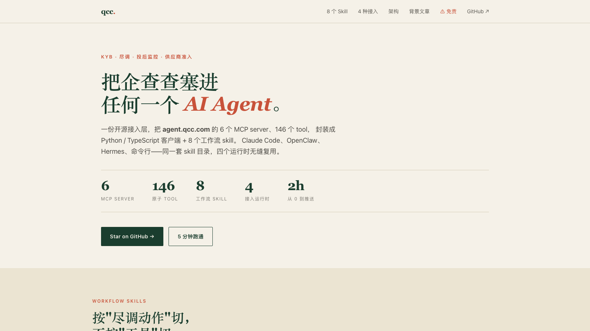

# qcc — 企查查 Agent 一站式接入

[](https://modelcontextprotocol.io)
[]()
[]()
[](./LICENSE)
[](https://qcc-agent.pages.dev)

[](https://qcc-agent.pages.dev)

> 🌐 **在线 Demo**:[qcc-agent.pages.dev](https://qcc-agent.pages.dev) — 项目落地页(8 个 skill 详解 + 4 种接入运行时 + 完整架构 + 背景文章) · 点上面截图直接访问

把 [agent.qcc.com](https://agent.qcc.com/guide) 提供的 6 个 MCP Streamable HTTP server(146 个 tool)封装成 **Python / TypeScript 客户端 + 8 个工作流 skill**,适用于 KYB / 尽调 / 投后监控 / 供应商准入等场景,支持四种接入形态:

| 接入形态 | 适合谁 | 入口 |
|---|---|---|
| **Claude Code 原生 MCP** | 一线员工 / 调研 / 临时尽调 | `.mcp.json` + `~/.claude/skills/` |
| **OpenClaw(龙虾)** | 常驻本地 Agent / 跨 IM(WhatsApp/Slack/Discord)消息侧用 | `~/.openclaw/openclaw.json5` |
| **Hermes(自定义 Agent / LLM 框架)** | 服务端编排 / 多用户 / 量化配额管理 | 读 `skills/_inventory.json` + 各 `manifest.yaml` |
| **Python / TS CLI 或 SDK** | 脚本任务 / 数据管道 / Jupyter | `qcc-py` / `qcc-ts` 或 `import qcc_client` |

## 目录

```
qcc/
├── .env.example           ← 复制为 .env,填 QCC_API_KEY
├── .mcp.json.example      ← Claude Code / Hermes 用
├── python/                ← Python 客户端 + CLI qcc-py
├── typescript/            ← TypeScript 客户端 + CLI qcc-ts
└── skills/
    ├── README.md          ← 8 个 skill 一览
    ├── _inventory.json    ← 146 tool 的全量 schema(单一事实源)
    ├── _hermes.md         ← Hermes 集成指南
    ├── _openclaw.md       ← OpenClaw 集成指南
    └── qcc-{anchor,basic-profile,ownership-trace,risk-screen,ipr-portfolio,operation-pulse,executive-background,person-portfolio}/
        ├── SKILL.md       ← Claude Code 触发(frontmatter description)
        └── manifest.yaml  ← Hermes / 自动化框架 工作流定义
```

## 6 个 MCP server

| key | tool | 用途 |
|---|---:|---|
| `company` | 16 | 工商 / 股东 / UBO / 对外投资 / 年报 / 财务 / 分支 / 上市 |
| `risk` | 35 | 司法 / 失信 / 限消限出 / 经营异常 / 严重违法 / 行政处罚 / 税务异常 / 破产 / 抵质押 |
| `ipr` | 18 | 专利 / 商标 / 著作权 / 数字资产 / 自媒体 |
| `operation` | 35 | 资质 / 招投标 / 招聘 / 融资 / 舆情 / 公告 / 政府约谈 / 抽检 / 召回 |
| `executive` | 42 | 法代 / 高管个人背调(双参数 USCC+人名,含历史) |
| `history` | — | 历史轨迹(需企业实名认证,免费 key 不可用) |

URL:`https://agent.qcc.com/mcp/<server>/stream`,鉴权 `Authorization: Bearer <KEY>`。

## 8 个工作流 skill

| skill | 串多少 tool | 单次配额 | 触发短语样例 |
|---|---:|---:|---|
| `qcc-anchor` | 2 | 1 | "锁定主体" / "确认公司" |
| `qcc-basic-profile` | 8 | 8 | "查工商信息" / "拉 KYB 摘要" |
| `qcc-ownership-trace` | 5 | 5 | "实控人是谁" / "穿透股权" / "UBO" |
| `qcc-risk-screen` | 34 | 12 / 19 / 34 (quick/default/full) | "查司法风险" / "授信前风险" |
| `qcc-ipr-portfolio` | 18 | 8 / 10 / 18 | "查专利" / "查商标" / "自媒体矩阵" |
| `qcc-operation-pulse` | 35 | 6 / 12 / 35(按 group 选) | "中标记录" / "融资历史" / "舆情" |
| `qcc-executive-background` | 42 | 20 / 42 / 人(current/full) | "法代背调" / "高管个人风险" |
| `qcc-person-portfolio` | 7 | 7 / 人 | "查...所有公司" / "...担任董监高的公司" / "导出关联企业" |

详见 [`skills/README.md`](./skills/README.md)。

---

# Quick Start(5 分钟跑通)

最快验证整套链路通不通,跑一个有具体产物(Excel)的 skill:

```bash
# 1) 配 key
git clone https://github.com/zhanglunet/qcc && cd qcc
cp .env.example .env && echo "QCC_API_KEY=你的_token" > .env

# 2) 装 Python 客户端 + skills 额外依赖(openpyxl)
cd python && python3.10 -m venv .venv && source .venv/bin/activate
pip install -e ".[skills]"

# 3) 跑 qcc-person-portfolio — 反查某自然人的全部对外公司,导出 Excel
python ../skills/qcc-person-portfolio/run.py \
  --person "雷军" \
  --anchor-by-name "小米科技"
# → ./雷军_companies.xlsx,8 sheet,~200 家关联公司
```

打开 `雷军_companies.xlsx`,主 sheet "汇总(去重)"按企业名称去重,标注每家公司是从哪几个维度命中。

跑通后,把 6 个 server 接进 Claude Code / OpenClaw / Hermes(下方)就是水到渠成的事。

---

# 接入

## 0. 配 API Key(所有路径共用)

```bash
cp .env.example .env
# 编辑 .env, 把 QCC_API_KEY= 后面填上 token(裸 token, 不带 Bearer 前缀)
export QCC_API_KEY=$(grep ^QCC_API_KEY .env | cut -d= -f2)
```

## A. Claude Code 原生 MCP

```bash
# 1) 配 MCP server
cp .mcp.json.example .mcp.json
# 把 ${QCC_API_KEY} 占位替换成实际 token, 或确保 env 有 QCC_API_KEY 让 Claude Code 自动替换

# 2) 装 8 个 skill 到用户级
cd skills
for d in qcc-*; do ln -s "$(pwd)/$d" ~/.claude/skills/$d; done

# 3) 重开 Claude Code
# 之后用户说 "查一下小米科技的基础尽调", Claude 自动匹配 qcc-basic-profile 并按 flow 调 MCP tool
```

详见 [Claude Code MCP 文档](https://docs.claude.com/en/docs/claude-code/mcp)。

## B. OpenClaw(龙虾)

完整流程见 [`skills/_openclaw.md`](./skills/_openclaw.md)。三行简版:

```bash
# 1) 把 6 个 server 合并到 ~/.openclaw/openclaw.json5 的 skills.entries
#    (json5 片段见 _openclaw.md §1, 6 个 server 块, transport: "http", apiKey 走 env)

# 2) 注入 env + 重启
export QCC_API_KEY=你的_token
openclaw gateway restart

# 3) 验证
openclaw skills status              # 应该有 6 行 qcc-* connected
openclaw skills info qcc-company    # 应该列出 16 个 tool
```

## C. Hermes(自定义 Agent / LLM 框架)

完整协议见 [`skills/_hermes.md`](./skills/_hermes.md)。三步:

1. 读 [`skills/_inventory.json`](./skills/_inventory.json) 注册 146 个 MCP tool
2. 读 [`skills/qcc-*/manifest.yaml`](./skills/) 装载 8 个工作流(`triggers` / `input` schema / `flow`)
3. 用任意 MCP HTTP 客户端 SDK 连 `.mcp.json` 里的 6 个 server,模板渲染 `{{anchor.uscc}}` 等占位

`skills/_hermes.md` 里有最小 Python loader 参考实现。

## D. Python / TS CLI / SDK

```bash
# Python
cd python && python3.10+ -m venv .venv && source .venv/bin/activate && pip install -e .
qcc-py servers                                                # 6 个 server
qcc-py tools company                                          # 16 个 tool
qcc-py call company get_company_by_query -a '{"searchKey":"小米科技"}'

# TypeScript
cd typescript && npm install
npx tsx src/cli.ts servers
npx tsx src/cli.ts tools company
npx tsx src/cli.ts call company get_company_by_query -a '{"searchKey":"小米科技"}'
```

库用法:

```python
import asyncio
from qcc_client import QccClient, Server

async def main():
    client = QccClient.from_env()
    result = await client.call(Server.COMPANY, "get_company_by_query",
                               {"searchKey": "小米科技"})
    print(result)

asyncio.run(main())
```

```typescript
import { QccClient, Server } from "qcc-client";
const client = QccClient.fromEnv();
const result = await client.call(Server.COMPANY, "get_company_by_query", {
  searchKey: "小米科技",
});
```

---

# 调用规范(所有接入形态共享)

1. **锚定先行**:用户给非 USCC 时,先 `qcc-company:get_company_by_query`。**多候选必须让用户选,禁止自动取 top1**(QCC 自己的工具描述里明令禁止)
2. **USCC 优先**:18 位 `[0-9A-HJ-NPQRTUWXY]{18}` 才是所有下游调用的 `searchKey`
3. **executive server 双参数**:`searchKey`(USCC)+ `personName`(姓名)
4. **配额错误码**:
   - `200001` — 鉴权格式错(检查别带 `Bearer` 前缀)
   - `300008` — 配额超 / 风控触发
   - `-32001` — 日频率超限

# 已知限制

- `history` server 需企业实名认证,本仓库不覆盖。拿到认证 key 后跑 `python -m qcc_client.dump_inventory > skills/_inventory.json` 自动并入,然后补一个 `qcc-historical-trail` skill
- `_inventory.json` 是 T+0 快照,QCC 服务端工具改名/增减不自动反映 — **每月跑一次** dump_inventory 保持同步
- 单体 OpCo 财务字段大量"企业选择不公示",上市集团合并数据需另查港交所 / SEC

# 上游参考

- 接入指南:https://agent.qcc.com/guide
- MCP 协议:https://modelcontextprotocol.io

# 免责声明

> ⚠️ 使用本项目前**必读**：[DISCLAIMER.md](./DISCLAIMER.md)

- 本项目是 `agent.qcc.com` 公开 API 的**第三方开源接入封装**,**非企查查官方产品**,与 苏州朗动信息技术有限公司 无任何隶属关系
- 数据来源、准确性、时效性由上游决定,**重大决策须交叉验证**
- 处理自然人信息须遵守《个人信息保护法 (PIPL)》《数据安全法》《网络安全法》等法律法规,使用者承担合规义务
- 输出仅供参考,**不构成法律 / 投资 / 税务 / 信贷决策依据**
- 本项目"按现状"提供,**无任何明示或暗示担保**,维护者不对使用产生的损失承担责任

完整免责条款见 [DISCLAIMER.md](./DISCLAIMER.md)。

# License

Apache-2.0(见 [LICENSE](./LICENSE))。

商标声明:"企查查"、"QCC" 为 苏州朗动信息技术有限公司 注册商标,本项目仅在描述性场景中引用。
